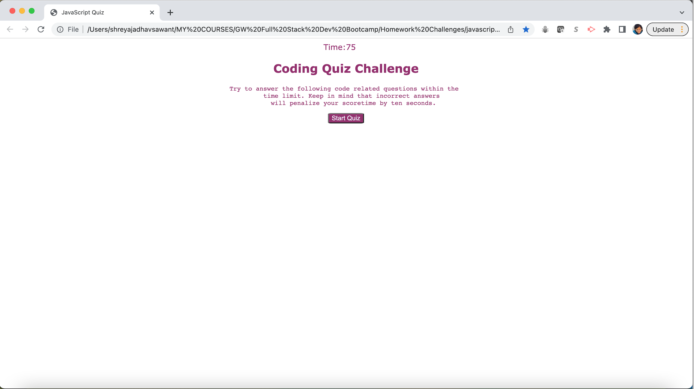

# javascript-quiz

## Description 

This is an application that contains a simple multiple choice JavaScript quiz with four questions and 75 seconds to answer them. 

* Click on the "Start" button to start.
* Then a timer will start and first question will appear, once you click on one of the options then next question will appear and also with the next question you can see if your previous answer was right or wrong.
* Every wrong answer will deduct 10 seconds from the timer.
* So higher the score the better your answers are. 
* Once you answer all questions or the timer is up, a "All Done" section will appear where you can enter your initials and once you click "Submit" button your score will be saved.
* Next, a page appears that shows your current score, "Go Back" button to retake the quiz, it also has "View Highscores" button which shows all your scores of the quiz attempts. Click "Hide Highscores" to hide the scores. Click "Clear Highscores" to clear previous scores. 

## Features

* The features are same as explained in the description, please refer above.

## Installation

N/A

## Screenshot

## Link to the deployed application

https://suvarna28.github.io/javascript-quiz/

## Credits

* Our TA, Sebastian for explaining div hide and show.
* Stackoverflow Website for the syntax I needed. 

